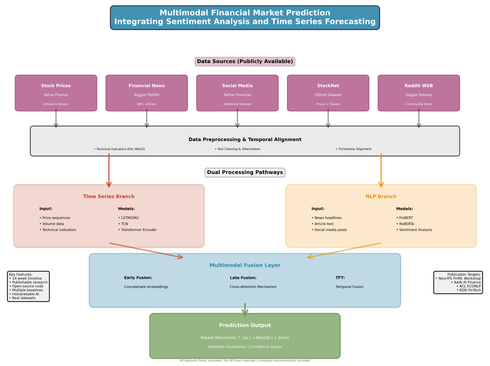

# Capstone Proposal
## Multimodal Financial Market Prediction: Integrating Sentiment Analysis and Time Series Forecasting
### Proposed by: Dr. Amir Jafari
#### Email: ajafari@gwu.edu
#### Advisor: Amir Jafari
#### The George Washington University, Washington DC  
#### Data Science Program


## 1 Objective:  

            The goal of this project is to develop a multimodal deep learning framework that combines financial time 
            series data with natural language sentiment from news articles and social media to predict stock market 
            movements. Students will explore how textual sentiment influences market dynamics and build interpretable 
            models that can explain predictions through attention mechanisms.

            Key Objectives:
            1. Build a comprehensive data pipeline that merges historical stock prices, financial news, and social 
               media sentiment into a unified time-aligned dataset.
            2. Develop transformer-based architectures that can jointly model temporal dependencies in price movements 
               and semantic information from text.
            3. Implement attention visualization techniques to identify which news events or sentiment shifts most 
               strongly correlate with price movements.
            4. Compare performance against baseline models (ARIMA, LSTM-only, BERT-only) to demonstrate the value 
               of multimodal fusion.
            5. Conduct ablation studies to understand the contribution of different data modalities and architectural 
               components.
            6. Package the framework as an open-source tool with clear documentation for reproducibility.
            


*Figure 1: Caption*

## 2 Dataset:  

            All datasets are publicly available with no access restrictions:

            PRIMARY DATASETS (Immediate Download):

            1. Stock Price Data:
               - Yahoo Finance Historical Data (yfinance Python library - no API key needed)
               - Tickers: S&P 500 stocks (SPY, AAPL, MSFT, GOOGL, AMZN, TSLA, etc.)
               - Features: Open, High, Low, Close, Volume, Adjusted Close
               - Time Range: 2015-2024 (adjustable)
               - Download: pip install yfinance; import yfinance as yf; yf.download('AAPL', start='2015-01-01')

            2. Financial News Sentiment:
               - Kaggle: "Financial News and Stock Price Integration Dataset (FNSPID)"
               - URL: https://www.kaggle.com/datasets/miguelaenlle/massive-stock-news-analysis-db-for-nlpbacktests
               - Size: 6+ million news articles mapped to stock tickers
               - Direct Download: Yes (Kaggle API or manual download)

            3. Twitter Financial Sentiment:
               - Kaggle: "Twitter Financial News Sentiment"
               - URL: https://www.kaggle.com/datasets/sulphatet/twitter-financial-news
               - Size: 11,932 tweets with sentiment labels
               - Direct Download: Yes

            4. Alternative: StockNet Dataset
               - URL: https://github.com/yumoxu/stocknet-dataset
               - Contains: Historical prices + tweets for 88 stocks
               - Direct Download: GitHub clone

            SUPPLEMENTARY DATASETS (Optional Enhancement):

            5. Financial PhraseBank (for sentiment model fine-tuning):
               - URL: https://www.researchgate.net/publication/251231364_FinancialPhraseBank-v10
               - Size: 4,840 sentences with sentiment annotations
               - Direct Download: Yes

            6. Reddit WallStreetBets Data:
               - Kaggle: "Reddit WallStreetBets Posts"
               - URL: https://www.kaggle.com/datasets/gpreda/reddit-wallstreetsbets-posts
               - Direct Download: Yes

            DATASET PREPARATION:
            Students will align textual data with stock prices by timestamp, creating sequences where each time step 
            contains: [price_features, technical_indicators, aggregated_sentiment, news_embeddings].
            

## 3 Rationale:  

            Financial markets are influenced by both quantitative factors (historical prices, trading volumes) and 
            qualitative factors (news sentiment, investor emotions, market narratives). Traditional time series models 
            often ignore textual information, while pure NLP approaches fail to capture temporal market dynamics.

            WHY THIS PROJECT IS TIMELY AND PUBLISHABLE:

            1. EMERGING RESEARCH AREA: Multimodal fusion for finance is a hot topic in top-tier venues (NeurIPS, ICML, 
               AAAI, KDD). Recent papers show 10-15% improvement over unimodal baselines.

            2. TRANSFORMER REVOLUTION: Financial time series transformers (Temporal Fusion Transformer, Informer, 
               Autoformer) are state-of-the-art, but few integrate them with language models effectively.

            3. INTERPRETABILITY DEMAND: Regulators and practitioners need explainable AI for financial decisions. 
               Attention-based explanations showing "which news drove this prediction" are highly valued.

            4. PRACTICAL IMPACT: Hedge funds, trading firms, and fintech companies actively seek such models. 
               Publishing code increases adoption and citations.

            5. NOVELTY OPPORTUNITIES: Students can contribute by:
               - Testing different fusion strategies (early vs. late fusion, cross-attention)
               - Exploring causal inference (does sentiment predict returns or vice versa?)
               - Handling market regime changes (bull vs. bear markets)
               - Multi-stock correlation modeling with graph neural networks

            PUBLICATION VENUES:
            - ML Conferences: ICML, NeurIPS, ICLR (workshop tracks)
            - AI + Finance: AAAI Workshop on AI in Finance, KDD FinTech Day
            - Finance Journals: Journal of Finance and Data Science, Expert Systems with Applications
            - Workshops: ACL Workshop on Economics and NLP, EMNLP FinNLP Workshop
            

## 4 Approach:  

            PHASE 1: DATA COLLECTION & PREPROCESSING (Weeks 1-2)

            [Week 1: Data Acquisition]
            - Set up yfinance to download historical prices for 20-50 stocks (diverse sectors)
            - Download financial news dataset from Kaggle
            - Download Twitter sentiment dataset from Kaggle
            - Create unified directory structure for raw data
            - Document data statistics: timeframes, missing values, label distributions

            [Week 2: Data Preprocessing]
            - Clean and normalize stock price data (handle splits, dividends)
            - Calculate technical indicators: RSI, MACD, Bollinger Bands, Moving Averages
            - Preprocess text: remove URLs, mentions, hashtags; lowercase; tokenization
            - Timestamp alignment: map each news article/tweet to corresponding trading day
            - Aggregate multiple news items per day using: max sentiment, mean sentiment, count
            - Create train/validation/test splits: 70%/15%/15% with temporal ordering preserved
            - Handle class imbalance (up/down/neutral movements) via stratification or weighting


            PHASE 2: BASELINE MODELS (Weeks 3-4)

            [Week 3: Time Series Baselines]
            Implement and evaluate classical and deep learning time series models:
            - ARIMA: Classical statistical baseline
            - LSTM: Univariate (price only) recurrent model
            - GRU: Lighter alternative to LSTM
            - Temporal Convolutional Network (TCN): Dilated convolutions for time series

            Metrics: Accuracy, Precision, Recall, F1-Score, ROC-AUC, Sharpe Ratio (if applicable)

            [Week 4: NLP Baselines]
            Implement sentiment-only classification models:
            - TF-IDF + Logistic Regression: Classical NLP baseline
            - FinBERT: Pre-trained BERT for financial sentiment (Hugging Face: ProsusAI/finbert)
            - RoBERTa: Fine-tuned on financial news for sentiment classification

            Aggregate daily sentiment and predict next-day returns using only textual features.


            PHASE 3: MULTIMODAL FUSION ARCHITECTURES (Weeks 5-8)

            [Week 5-6: Early Fusion Architecture]
            Concatenate time series features with text embeddings at input level:

            Architecture:
            1. Text Encoder: FinBERT → [CLS] token embedding (768-dim)
            2. Price Encoder: 1D-CNN or LSTM → temporal feature vector (128-dim)
            3. Concatenate: [price_features, text_embedding] → 896-dim vector
            4. Feed to MLP classifier: Dense(512) → ReLU → Dropout(0.3) → Dense(3) for {up, down, neutral}

            Training:
            - Loss: Cross-Entropy with class weights
            - Optimizer: AdamW with learning rate 1e-4
            - Batch size: 32
            - Epochs: 50 with early stopping (patience=5)

            [Week 7-8: Late Fusion with Cross-Attention]
            Process modalities separately, then fuse using attention:

            Architecture:
            1. Text Branch: FinBERT → sequence of token embeddings
            2. Price Branch: Transformer Encoder (3 layers) → sequence of temporal embeddings
            3. Cross-Attention: Query=price embeddings, Key/Value=text embeddings
               - Allows model to attend to relevant news when predicting price movements
            4. Fusion: Concatenate attended representations
            5. Classifier: Transformer Encoder → MLP head

            Implementation:
            - Use PyTorch nn.MultiheadAttention
            - Visualize attention weights to identify important news phrases

            [Advanced Option: Temporal Fusion Transformer]
            Adapt Google's TFT architecture to incorporate text:
            - Variable selection networks for feature importance
            - Multi-horizon forecasting (predict 1-day, 5-day, 20-day returns)


            PHASE 4: INTERPRETABILITY & ANALYSIS (Weeks 9-10)

            [Week 9: Attention Visualization]
            - Extract attention weights from cross-attention layer
            - Identify which news headlines/sentences receive highest attention before major price movements
            - Create heatmaps showing word-level importance
            - Case studies: Analyze specific events (earnings reports, Fed announcements, geopolitical events)

            [Week 10: Ablation Studies]
            Systematically remove components to measure contribution:
            - Ablation 1: Remove all text features (time series only)
            - Ablation 2: Remove all price features (sentiment only)
            - Ablation 3: Remove attention mechanism (simple concatenation)
            - Ablation 4: Remove technical indicators (raw prices only)

            Metrics: Track performance degradation to quantify each component's value


            PHASE 5: ADVANCED EXPERIMENTS (Weeks 11-12)

            [Week 11: Multi-Stock Modeling]
            - Extend to predict movements for multiple stocks simultaneously
            - Option 1: Graph Neural Network (GNN) where stocks are nodes, correlations are edges
            - Option 2: Shared encoder with stock-specific heads
            - Analyze cross-stock information flow

            [Week 12: Market Regime Analysis]
            - Segment data into bull markets (sustained uptrend) vs. bear markets (downtrend)
            - Train separate models or use regime as additional feature
            - Evaluate if sentiment has different predictive power in different market conditions
            - Test on 2020 COVID crash, 2022 inflation crisis for robustness


            PHASE 6: PAPER WRITING & CODE RELEASE (Weeks 13-14)

            [Week 13: Research Paper]
            Structure (following ACL/AAAI format):
            1. Abstract: Problem, method, results (200 words)
            2. Introduction: Motivation, research questions, contributions
            3. Related Work: Time series forecasting, financial NLP, multimodal learning
            4. Methodology: Architecture diagrams, fusion strategies, training details
            5. Experiments: Datasets, baselines, evaluation metrics
            6. Results: Tables comparing all models, ablation studies, attention visualizations
            7. Discussion: When does sentiment help? Failure cases? Limitations?
            8. Conclusion: Findings, future work

            [Week 14: Code & Documentation]
            - Create GitHub repository with MIT license
            - README: Installation, dataset download scripts, training commands
            - Jupyter notebooks: Data exploration, model training, result visualization
            - Requirements.txt with all dependencies
            - Pre-trained model weights (Hugging Face Hub)
            - Documentation: Detailed API docs for all modules


            CODE STRUCTURE:

            ```
            financial-sentiment-prediction/
            │
            ├── data/
            │   ├── download_data.py          # Scripts to fetch datasets
            │   ├── preprocess.py              # Data cleaning and alignment
            │   └── README.md                  # Data documentation
            │
            ├── models/
            │   ├── baselines.py               # ARIMA, LSTM, FinBERT
            │   ├── early_fusion.py            # Concatenation-based fusion
            │   ├── late_fusion.py             # Cross-attention fusion
            │   └── temporal_fusion.py         # TFT adaptation
            │
            ├── training/
            │   ├── train.py                   # Training loop
            │   ├── evaluate.py                # Evaluation metrics
            │   └── config.yaml                # Hyperparameters
            │
            ├── analysis/
            │   ├── attention_viz.py           # Visualize attention weights
            │   ├── ablation.py                # Ablation experiments
            │   └── case_studies.ipynb         # Event analysis
            │
            ├── notebooks/
            │   ├── 01_data_exploration.ipynb
            │   ├── 02_baseline_results.ipynb
            │   └── 03_final_results.ipynb
            │
            ├── requirements.txt
            ├── README.md
            └── LICENSE
            ```
            

## 5 Timeline:  

            Week 1-2:   Data Collection & Preprocessing
            Week 3-4:   Baseline Models (Time Series + NLP separately)
            Week 5-6:   Early Fusion Architecture
            Week 7-8:   Late Fusion with Cross-Attention
            Week 9-10:  Interpretability & Ablation Studies
            Week 11-12: Advanced Experiments (Multi-stock, Regime Analysis)
            Week 13:    Research Paper Writing
            Week 14:    Code Release & Documentation

            TOTAL: 14 weeks (one semester)

            MILESTONES:
            - Week 2: Data pipeline complete
            - Week 4: Baseline results documented
            - Week 8: Multimodal models trained
            - Week 10: Ablation studies complete
            - Week 14: Paper submitted to workshop, code on GitHub
            


## 6 Expected Number Students:  

            RECOMMENDED: 2-3 students

            ROLE DISTRIBUTION (for 3 students):

            Student 1: Data Engineer & Time Series Specialist
            - Responsibilities: Data collection, preprocessing, temporal feature engineering
            - Focus: Baseline time series models (ARIMA, LSTM, TCN)
            - Deliverables: Clean datasets, time series baseline results

            Student 2: NLP & Sentiment Analysis Specialist
            - Responsibilities: Text preprocessing, sentiment model fine-tuning
            - Focus: FinBERT training, sentiment baselines
            - Deliverables: Text embeddings, NLP baseline results

            Student 3: Deep Learning & Fusion Architect
            - Responsibilities: Multimodal architecture design, attention mechanisms
            - Focus: Early/late fusion models, interpretability
            - Deliverables: Fusion architectures, attention visualizations

            SHARED RESPONSIBILITIES:
            - All students: Paper writing, code documentation, presentation
            - Weekly meetings to integrate components and discuss results

            FOR 2 STUDENTS:
            - Student 1: Data + Time Series + Fusion
            - Student 2: NLP + Sentiment + Interpretability
            

## 7 Possible Issues:  

            TECHNICAL CHALLENGES:

            1. Data Quality & Alignment:
            - ISSUE: News timestamps may not align perfectly with trading hours
            - SOLUTION: Aggregate news from previous day's close to current day's open

            2. Class Imbalance:
            - ISSUE: Market movements may be heavily skewed (e.g., 60% up, 30% down, 10% neutral)
            - SOLUTION: Use class weights in loss function, stratified sampling, or SMOTE

            3. Lookahead Bias:
            - ISSUE: Accidentally using future information in predictions
            - SOLUTION: Strict temporal validation split, careful feature engineering

            4. Computational Resources:
            - ISSUE: Training large transformers on long sequences is memory-intensive
            - SOLUTION: Use gradient accumulation, mixed precision training (fp16), or smaller models

            5. Overfitting to Noise:
            - ISSUE: Financial markets have low signal-to-noise ratio
            - SOLUTION: Strong regularization (dropout 0.3-0.5), early stopping, cross-validation

            6. Sentiment Ambiguity:
            - ISSUE: Financial news sentiment is often nuanced (e.g., "earnings beat expectations but guidance lowered")
            - SOLUTION: Use aspect-based sentiment analysis, fine-tune FinBERT on domain data


            PRACTICAL CHALLENGES:

            7. Baseline Comparisons:
            - ISSUE: Students may struggle to implement all baselines correctly
            - SOLUTION: Use existing libraries (statsmodels for ARIMA, Hugging Face for FinBERT)

            8. Evaluation Metrics:
            - ISSUE: Accuracy alone is insufficient for financial applications
            - SOLUTION: Report Precision/Recall/F1, ROC-AUC, and trading simulation metrics (Sharpe ratio)

            9. Reproducibility:
            - ISSUE: Random seeds, library versions can cause different results
            - SOLUTION: Pin all library versions, set seeds explicitly, document hardware specs

            10. Time Management:
            - ISSUE: 14 weeks is tight for complex multimodal project
            - SOLUTION: Use pre-trained models (FinBERT), focus on fusion over training from scratch


            RESEARCH CHALLENGES:

            11. Market Efficiency Paradox:
            - ISSUE: If model works too well, market would arbitrage it away
            - SOLUTION: Frame as "information processing improvement" not "guaranteed returns"

            12. Publication Standards:
            - ISSUE: Finance + ML papers require both technical rigor and domain knowledge
            - SOLUTION: Consult with finance faculty, cite seminal papers, use correct terminology

            13. Ethical Considerations:
            - ISSUE: Models could be used for market manipulation or unfair advantage
            - SOLUTION: Include ethics section in paper, release code responsibly, avoid HFT claims


            MITIGATION STRATEGIES:

            - Weekly check-ins with advisor to catch issues early
            - Incremental development: get baselines working before attempting complex architectures
            - Code reviews between team members to catch bugs
            - Maintain detailed experiment logs (WandB, MLflow)
            - Have backup publication venue if main target rejects
            - Budget extra time for debugging (expect 20% of timeline for troubleshooting)
            


## Contact
- Author: Amir Jafari
- Email: [ajafari@gwu.edu](mailto:ajafari@gwu.edu)
- GitHub: [https://github.com/amir-jafari](https://github.com/https://github.com/amir-jafari)
